# 策略中心

## 取数模块如下

 * 品牌增长概览: 品牌表现(销售金额，购买人数，客单价，新品销售金额等)。
 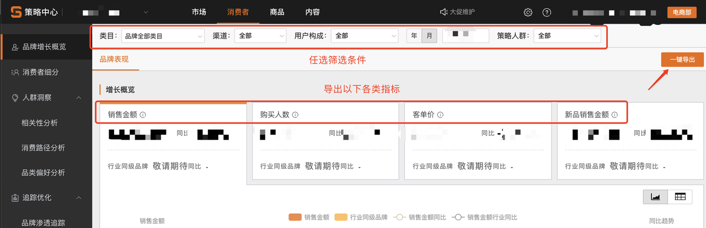

 * 消费者细分: 自定义人群画像（全部画像标签）。
 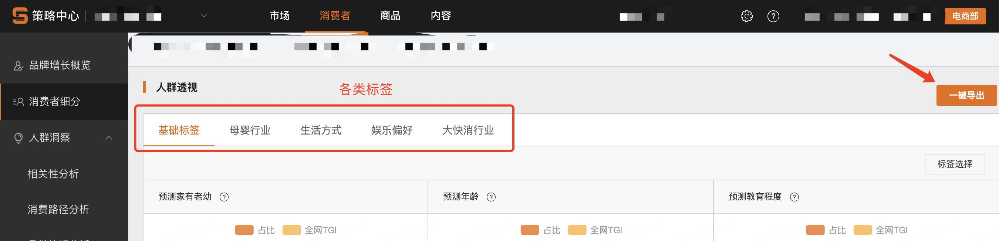

 * 相关性分析: 一级/叶子/品牌类目购买偏好。
 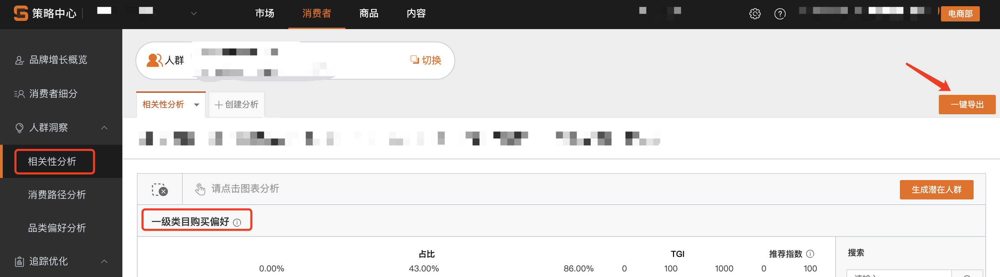
 
 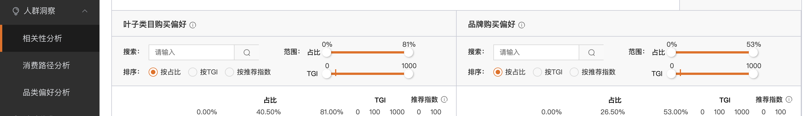

 * 品牌得失追踪: 得失来源，品牌转换。
 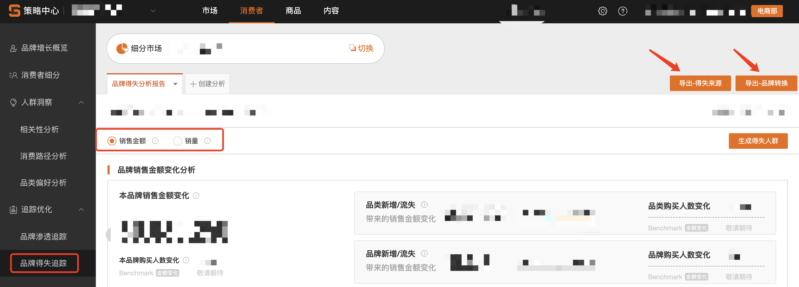
 
 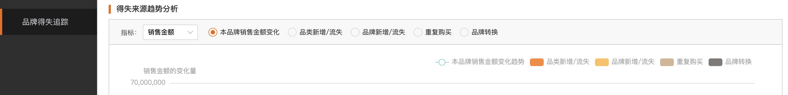
 
 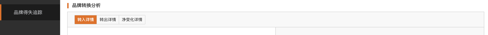

 * 市场概览-趋势：市场概况下各指标的过往趋势数据。
 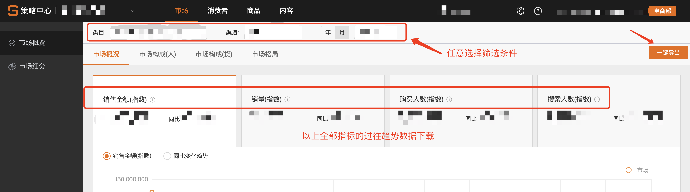

 * 市场概览-详情：市场格局下品牌详情，变化趋势（任选品牌）；单品详情，变化趋势（任选单品）。
 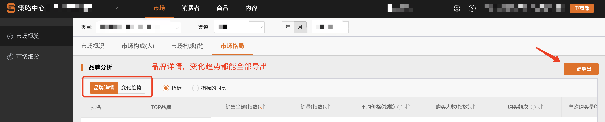
 
 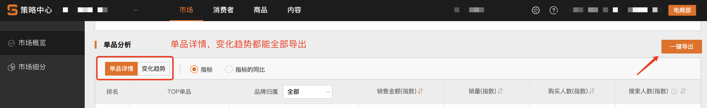
 
 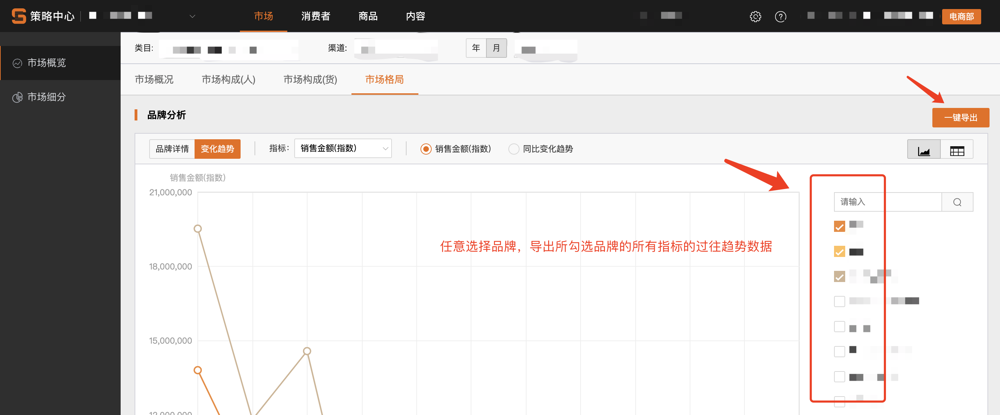
 
 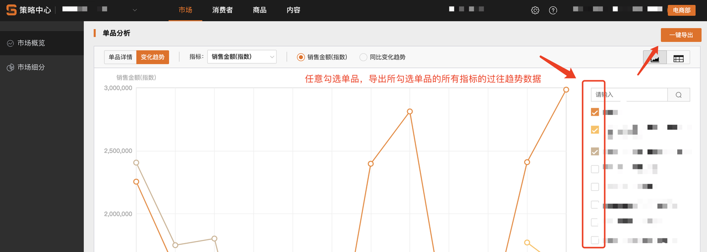

 * 市场细分：各分析报告的品牌详情，变化趋势（任选品牌）；单品详情，变化趋势（任选单品）。
 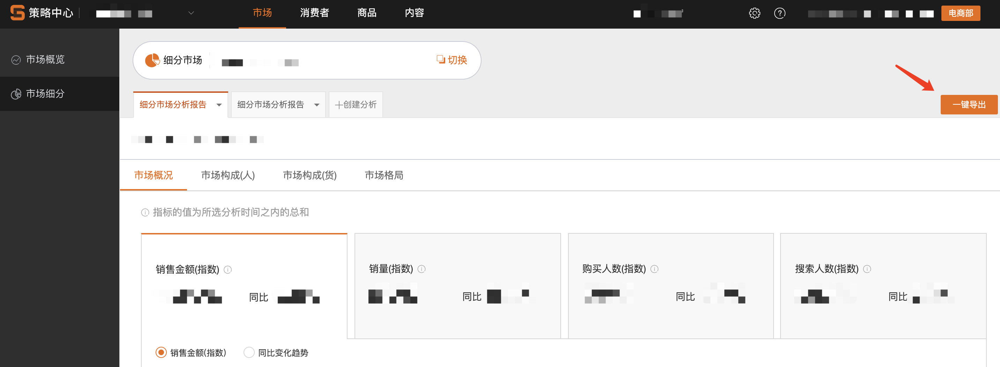
 
 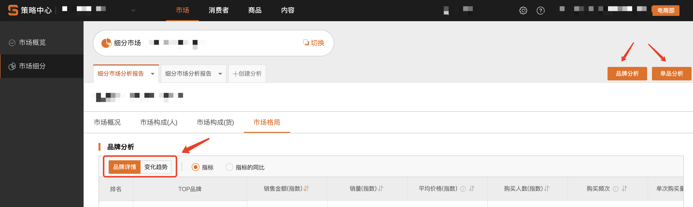
 
 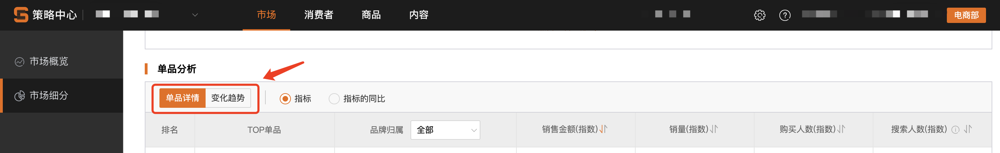

